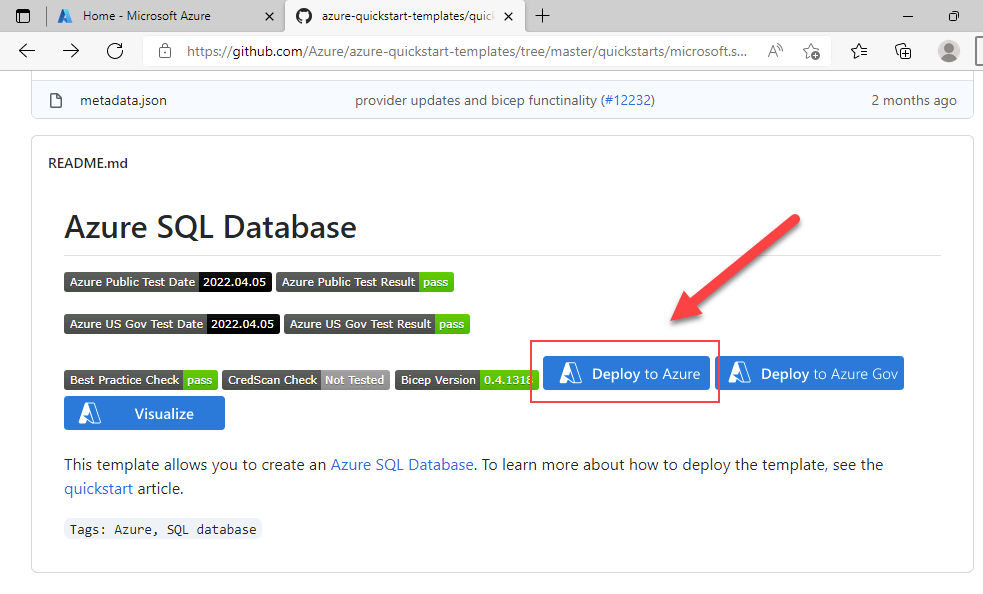
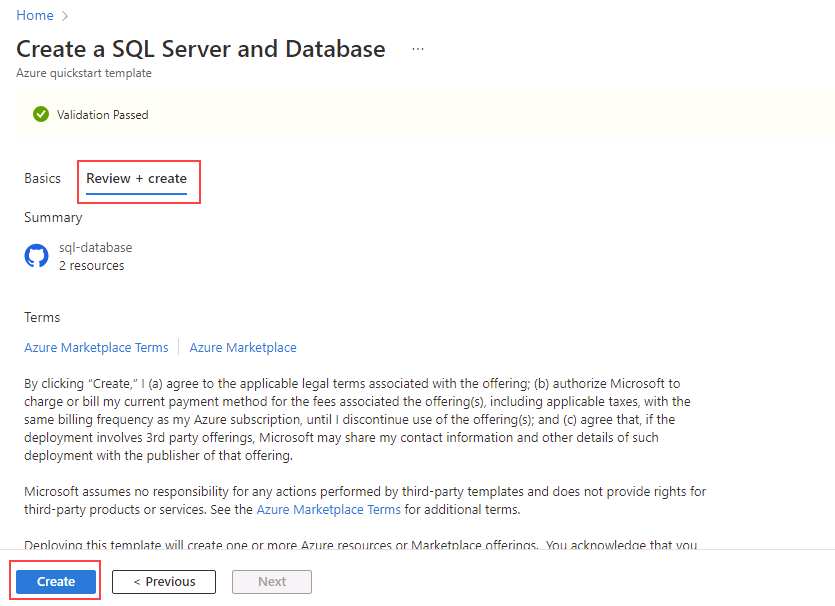
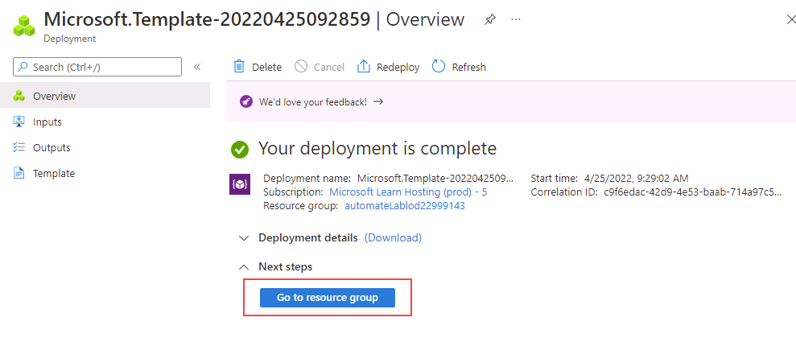

# Implantar um Azure SQL Database a partir de um template

**Tempo estimado: 15 minutos**

Você foi contratado como Engenheiro de Dados Sênior para ajudar a automatizar as operações diárias de administração de bancos de dados. Essa automação deve ajudar a garantir que os bancos da AdventureWorks continuem operando com alto desempenho e fornecer formas de gerar alertas com base em determinados critérios. A AdventureWorks usa SQL Server tanto em ofertas de Infrastructure as a Service (IaaS) quanto de Platform as a Service (PaaS).

## Explorar um template do Azure Resource Manager

1. No Microsoft Edge, abra uma nova guia e acesse o caminho abaixo em um repositório do GitHub. Ele contém um ARM template para implantar um recurso SQL Database.

    ```url
    https://github.com/Azure/azure-quickstart-templates/tree/master/quickstarts/microsoft.sql/sql-database
    ```

1. Clique com o botão direito em **azuredeploy.json** e selecione **Open link in new tab** para visualizar o ARM template, que deverá ser semelhante ao seguinte:

    ```JSON
    {
    "$schema": "https://schema.management.azure.com/schemas/2019-04-01/deploymentTemplate.json#",
    "contentVersion": "1.0.0.0",
    "parameters": {
        "serverName": {
        "type": "string",
        "defaultValue": "[uniqueString('sql', resourceGroup().id)]",
        "metadata": {
            "description": "The name of the SQL logical server."
        }
        },
        "sqlDBName": {
        "type": "string",
        "defaultValue": "SampleDB",
        "metadata": {
            "description": "The name of the SQL Database."
        }
        },
        "location": {
        "type": "string",
        "defaultValue": "[resourceGroup().location]",
        "metadata": {
            "description": "Location for all resources."
        }
        },
        "administratorLogin": {
        "type": "string",
        "metadata": {
            "description": "The administrator username of the SQL logical server."
        }
        },
        "administratorLoginPassword": {
        "type": "securestring",
        "metadata": {
            "description": "The administrator password of the SQL logical server."
        }
        }
    },
    "variables": {},
    "resources": [
        {
        "type": "Microsoft.Sql/servers",
        "apiVersion": "2020-02-02-preview",
        "name": "[parameters('serverName')]",
        "location": "[parameters('location')]",
        "properties": {
            "administratorLogin": "[parameters('administratorLogin')]",
            "administratorLoginPassword": "[parameters('administratorLoginPassword')]"
        },
        "resources": [
            {
            "type": "databases",
            "apiVersion": "2020-08-01-preview",
            "name": "[parameters('sqlDBName')]",
            "location": "[parameters('location')]",
            "sku": {
                "name": "Standard",
                "tier": "Standard"
            },
            "dependsOn": [
                "[resourceId('Microsoft.Sql/servers', concat(parameters('serverName')))]"
            ]
            }
        ]
        }
    ]
    }
    ```

1. Revise e observe as propriedades JSON.

1. Feche a guia **azuredeploy.json** e volte à guia que contém a pasta **sql-database** no GitHub. Role a página para baixo e selecione **Deploy to Azure**.

    

1. A página do quickstart template **Create a SQL Server and Database** será aberta no Azure portal, com os detalhes do recurso parcialmente preenchidos pelo ARM template. Preencha os campos em branco com as informações abaixo:

    - **Resource group:** um nome começando com *contoso-rg*
    - **Sql Administrator Login:** labadmin
    - **Sql Administrator Login Password:** &lt;informe uma senha forte&gt;

1. Selecione **Review + create** e depois **Create**. A implantação levará aproximadamente 5 minutos.

    

1. Quando a implantação for concluída, selecione **Go to resource group**. Você será direcionado ao Azure Resource Group, que conterá um recurso **SQL Server** com nome aleatório criado pelo deployment.

    

---

## Limpar os recursos

Se você não for usar o Azure SQL Server para nenhuma outra finalidade, poderá remover os recursos criados neste laboratório.

### Excluir o grupo de recursos

Se você criou um novo grupo de recursos para este laboratório, pode excluí-lo para remover todos os recursos criados nele.

1. No Azure portal, selecione **Resource groups** no painel de navegação esquerdo ou pesquise **Resource groups** na barra de pesquisa e selecione o resultado.

1. Abra o grupo de recursos criado para este laboratório. Ele conterá o Azure SQL Server e os demais recursos criados durante o lab.

1. Selecione **Delete resource group** no menu superior.

1. Na caixa de diálogo **Delete resource group**, digite o nome do grupo de recursos para confirmar e selecione **Delete**.

1. Aguarde a exclusão do grupo de recursos.

1. Feche o Azure portal.

### Excluir somente os recursos do laboratório

Se você não criou um novo grupo de recursos para este laboratório e deseja manter o grupo e seus recursos anteriores, ainda poderá excluir somente os recursos criados neste lab.

1. No Azure portal, selecione **Resource groups** no painel de navegação esquerdo ou pesquise **Resource groups** na barra de pesquisa e selecione o resultado.

1. Abra o grupo de recursos usado neste laboratório. Ele conterá o Azure SQL Server e os outros recursos criados durante o lab.

1. Selecione todos os recursos cujo nome começa com o nome do SQL Server informado anteriormente no laboratório.

1. Selecione **Delete** no menu superior.

1. Na caixa de diálogo **Delete resources**, digite **delete** e selecione **Delete**.

1. Selecione **Delete** novamente para confirmar a exclusão dos recursos.

1. Aguarde a exclusão dos recursos.

1. Feche o Azure portal.

---

Você concluiu este laboratório com sucesso.

Você acabou de ver como, com um único clique em um link de Azure Resource Manager template, é possível criar facilmente um Azure SQL server e um database.
